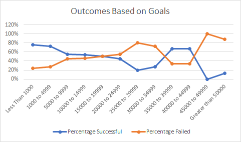

# Kickstarting with Excel

- mo comentario

## Overview of Project

### The pourpous of this excel file and the two graphs is to let you know what are your best options for your campaign, options like when to release it, how long should it be, calculating how much your pledge must be and also how much your budget should be to succeed.

## Analysis and Challenges

### Your best time of the year to launch your campaign is between may and june.

### For your goal you have two options: it to be between $1000 and $5000 to have an 80% chance to succeed, or your second option is between $40000 and $45000 and the chances are almost the same as to do have an outcome of $1000, just like a 5% less chance but i would risk it. You wanted to have a goal of $10000, but it's a 50/50 chance to accomplish that, so my advise is to take one of the options that I gave you.

### Challenges and Difficulties Encountered

## Results

- The best option is to launch the campaign between may and june, there stand the most successful campaigns.

- You really should lower or grow your goal, the number you have in mind is not so succesful like the ones i gave you.

- the only thing i couldn't do and i recomend to know is the time your campaign should last.

- Also it would have been useful to know in how much time you would've had the amount for the play.
